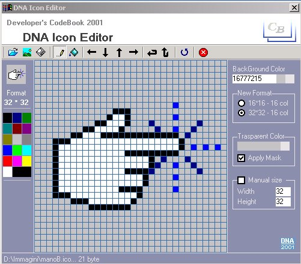



## dnaIconEdit

### Description

A small Test example of Editor for Icons Supports and save 16 * 16 and 32 32 formats save with format up to 64 x 64, support transparencies and masks accepts Ico and Bmp, and converts bmp to Ico, wheel and it moves the images.. and other this is a revision of other code on psc : sorry for the Italian comment
 
### More Info
 

             |
---                |---
**Submitted On**   |2002-08-05 12:18:56
**By**             |[Mark](https://github.com/Planet-Source-Code/PSCIndex/blob/master/ByAuthor/mark.md)
**Level**          |Advanced
**User Rating**    |4.6 (37 globes from 8 users)
**Compatibility**  |VB 4\.0 \(32\-bit\), VB 5\.0, VB 6\.0
**Category**       |[Graphics](https://github.com/Planet-Source-Code/PSCIndex/blob/master/ByCategory/graphics__1-46.md)
**World**          |[Visual Basic](https://github.com/Planet-Source-Code/PSCIndex/blob/master/ByWorld/visual-basic.md)
**Archive File**   |[dnaIconEdi114495852002\.zip](https://github.com/Planet-Source-Code/mark-dnaiconedit__1-37641/archive/master.zip)

